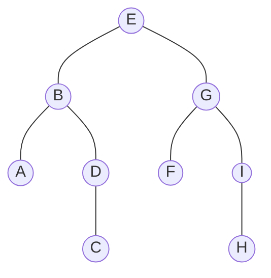

# 二叉树
大部分高级结构是基于二叉树的，二叉树应用广泛和它的形态有关。
二叉树有很多优势：
1. 二叉树易于构造；
2. 在二叉树上能进行高效率的访问。例如一棵有N个结点的满二叉树，树的高度是O(logN)，从根结点走到叶子结点，只需要走logN步。
3. 二叉树是天然的分治结构，使得对树的操作非常方便和高效，从而能得到很好的算法复杂度。
4. 二叉树适合做区间操作，可以把二叉树内的一棵子树看作整棵树的一个子区间，求区间最值，区间和等，用二叉树都很快捷。
5. 二叉树上的结点的遍历和计算都非常简便，适合用BFS和DFS处理。二叉树可以一层层的搜索，使用的是BFS；对于二叉树任意一个子结点，以它为根又是一棵二叉树，这是一种递归的结构，用DFS遍历二叉树非常快捷。
## 二叉树的定义
* 二叉树的第1层是一个结点，称为根，它最多有两个子结点，分别是左子结点，右子结点，以它们为根的子树称为左子树，右子树。二叉树上的每个结点，都是按照这个规则逐层构建出来的。
* 显然，二叉树的每一层结点数量是按2的倍数递增的，第1层有2^0^=1个结点，这个结点是根结点，第2层有2^1^=2个结点，以此类推，第i层最多有2^i-1^个结点。
* 二叉树的每个结点不必都有左子结点，右子结点，可以只有一个子结点或没有子结点，没有子结点的结点称为叶子结点。有各种形态的二叉树：
1. 满二叉树
如果二叉树每一层的结点数都是满的，则称为满二叉树。一个n层的满二叉树，其结点一共有2^n^-1个，依次编号为1、2、3……2^n^-1
2. 完全二叉树
如果满二叉树最后一层缺失结点，并且缺失的结点编号都在最后，则称它为完全二叉树。
3. “链状”二叉树
“链状”二叉树每一层都缺失很多结点，退化成一个长链条状，此时二叉树失去了它的优势。
* 满二叉树和完全二叉树是平衡的二叉树，因为每个结点的左右子树的数量都差不多。“链状”二叉树是不平衡的二叉树，退化成了线性结构，和低效的链表没多大区别。因此维护二叉树的平衡性是基于二叉树的数据结构或算法的关键操作。
## 二叉树的存储
二叉树的一个结点，需要存储结点的值，以及指向左右子结点的指针。
在算法竞赛中，为了使代码简单高效，编程速度加快，一般用静态数组来实现二叉树。定义一个大小为N的静态结构体数组，用它来存储一棵二叉树：
```C++
struct Node//静态二叉树
{
    char value;
    int lson;int rson;//指向左右子结点的存储位置，编程时可把lson简写为ls或l
}tree[N];
```
编程时一般不用tree[0]，因为0被用来表示空结点，例如叶子结点tree[2]没有子结点，就把它的子结点lson和rson赋值为0；
完全二叉树的访问非常便捷，此时连lson、rson都不需要，一棵结点总数量为k的完全二叉树，设1号结点为根结点，该二叉树有以下性质：
1. i>1的结点，其父结点是1/2；
2. 如果2*i>k，那么结点i没有子结点；2*i+1>k，那么结点i没有右子结点；
3. 如果结点i有子结点，那么它的左子结点是2*i，右子结点是2*i+1；
用静态数组tree[N]表示满二叉树，N需要设为多大？
* 在极端情况下，需要设为元素数量的4倍。例如题目给的元素有m=8个，此时建立的满二叉树有log2m+1=3+1=4层，4层的满二叉树共有N=2^4^-1=15个结点，第4层只在一个结点v上放了一个元素，其它7个结点都浪费了。这样还不够，还需要建第5层，因为虽然结点v是叶子结点，但是需要计算v的子结点，判断其是否为空。所以这棵满二叉树的结点数量是32，为m的4倍。满二叉树tree[N]的空间需要设为N=4m，即元素数量的4倍。
## 二叉树的遍历
二叉树的遍历是操作二叉树的基本问题，BFS和DFS是遍历二叉树的基本方法。
按访问二叉树的顺序，对父结点、左子结点、右子结点进行组合，有先序遍历、中序遍历、后序遍历这3种访问顺序，这里默认左子结点在右子结点前面。

### 宽度优先遍历
有时需要按层次，一层一层的遍历二叉树,此时用BFS是最合适的。从根结点开始，在每一层，把下一层的结点放进队列。例如用BFS遍历上图所示的二叉树步骤如图所示：
|步骤|出队|入队|当前队列|
|-|-|-|-|
1||E|E|
2|E|BG|BG|
3|B|AD|GAD|
4|G|FI|ADFI|
5|A||DFI|
6|D|C|FIC|
7|F||IC|
8|I|H|CH|
9|C||H|
10|H||空|
出队的顺序EBGADFIGH，按层深度逐层输出。
在任意时刻，队列中最多只有相邻两层的结点。
### 深度优先遍历
用DFS遍历二叉树，代码极其简单。
1. 先序遍历
按父结点，左子结点、右子结点的顺序访问。图中访问返回的结果是EBADCGFIH。对任意一个结点的遍历，都符合父结点、左子结点、右子结点的顺序。
先序遍历用递归实现非常简单：
```C++
void preorder(node * root)
{
    cout<<root->value;//输出结点的值
    preorder(root->lson);//递归左子树
    preorder(root->rson);//递归右子树
}
```
在这个递归代码中，先输出父结点的值，然后分别递归左、右子树，从而实现了在任意子树上，输出的遍历结果都是先序遍历的结果。
2. 中序遍历
按左子结点，父结点，右子结点的顺序访问，图中访问返回的结果是ABCDEFGHI。对任意一个结点的遍历，都符合左子结点、父结点、右子结点的顺序。在中序遍历的结果中，排在根结点左边的结点都在左子树上，排在根结点右边的结点都在右子树上。
中序遍历正好是字典序，这不是巧合，因为如图所示是一个二叉搜索树，在二叉搜索树中，中序遍历实现了排序功能，返回的结果是一个有序排列。
```
void inorder(node * root)
{
    inorder(root->lson);//递归左子树
    cout<<root->value;//输出结点的值
    inorder(root->rson);//递归右子树
}
```
3. 后序遍历
按左子结点、右子结点、父结点的顺序访问。图中访问结果是ACDBFHIGE。后序遍历的最后一个结点是根结点。
```
void postorder(node * root)
{
    postorder(root->lson);//递归左子树
    postorder(root->rson);//递归右子树
    cout<<root->value;//输出结点的值
}
```
4. 3种遍历的关系
如果已知某棵二叉树的3种遍历结果，则可以把这棵二叉树构造出来：“中序遍历结果+先序遍历结果”或者“中序遍历结果+后序遍历结果”都能确定一棵二叉树。
可见，只有中序遍历结果是必须要知道的。如果不知道中序遍历结果，只有“先序遍历结果+后序遍历结果”，则不能确定一棵二叉树。