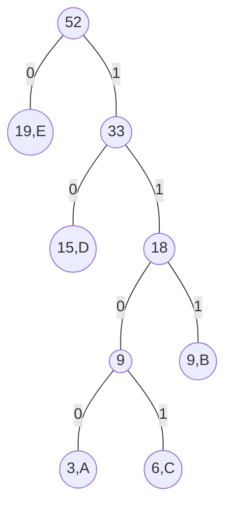

# 贪心
贪心算法的原理很容易理解：把整个问题分解成多个步骤，在每个步骤都选取当前步骤的最优方案，直到所有步骤结束；每个步骤都不考虑对后续步骤的影响，在后续步骤中也不再回头改变前面的选择。
贪心算法虽然简单，但它有广泛的应用。例如图论中的最小生成树(Minimal Spanning Tree,MST)算法、单源最短路径(Dijkstra)都是贪心算法的典型应用。
贪心算法由于每一步都在局部计算，且只选取 当前最优的步骤做计算，不管其它可能的计算方案，所以计算量很小，可以说是计算复杂度最低的算法了。与此相对，暴力法一般是计算复杂度最高的，因为暴力法计算了所有可能的方案。
贪心的主要问题是不一定能得到最优解，因为局部最优并不总是导致全局最优。
一个问题是否能用贪心算法求解，有时很容易判断，有时不那么容易判断。当一道题目的解题过程是从局部推算到全局时，若使用贪心算法不能求得最优解，则一般能用DP求得最优解。
## 贪心算法求解的问题的特征
1. 最优子结构性质。当一个问题的最优解包含其子问题的最优解时，称此问题具有最优子结构性质，也称此问题满足最优性原理。也就是说，从局部最优能扩展到全局最优。
2. 贪心选择性质。问题的整体最优解可以通过一系列局部选择来得到。

贪心算法没有固定的算法框架，关键是如何贪心策略。贪心策略必须具备无后效性，即某个状态以后的过程不会影响以前的状态，只与当前状态有关。
## 哈夫曼编码
把一段字符串存储在计算机中，其中包含很多单词，每个单词出现的频次不一样，有的频次高，有的频次低。因为数据在计算机中都是用二进制码来表示的，所以需要把每个单词编码成一个二进制数。最简单的编码方式是把每个单词都用相同长度的二进制数表示。这种编码简单，但是不节省空间。为了节省空间，可以用**变长编码**：出现次数多的单词用短码表示，出现次数少的单词用长码表示。
编码算法的基本要求：编码后得到的二进制串，能唯一的进行解码还原。如果某个编码是另一个编码的前缀(prefix)，即这两个编码有包含关系，将会导致混淆。
给定一个字符串，如何编码才能使得编码后的总长度最小？
哈夫曼编码是前缀编码算法中的最优算法，它用到了贪心算法的原理，下面介绍这种编码的构造方法。

二叉树如图所示。每个二叉树的分支，左边是0，右边是1。二叉树末端的叶子结点是编码。把编码放在叶子结点上，可以保证符合前缀不包含的要求。出现频次最高的单词E，在靠近根部的位置，编码最短；出现频次最低的单词A，在二叉树最深处，编码最长。
哈夫曼编码利用贪心算法的原理构造二叉编码树。先对所有单词按出现频次排序，然后从出现频次最少的单词开始，用贪心算法的原理将其安排在二叉树上。
每个结点圆圈内的数字是这个子树下单词出现的频次之和。
贪心的过程：按单词出现频次，从底层往顶层生成二叉树，注意每一步都要按频次重新排序。这个过程可以保证出现频次少的单词被放在二叉树的底层，其编码最长；出现频次多的单词放在二叉树上层，其编码更短。